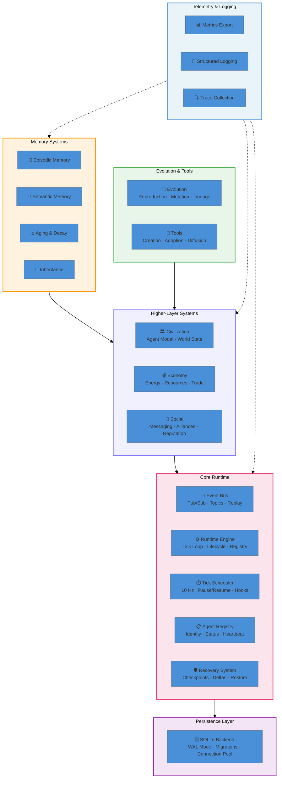

<p align="center">
  <picture>
    <source media="(prefers-color-scheme: dark)" srcset="https://img.shields.io/badge/SUBSTRATE-%23000000.svg?style=for-the-badge&logo=python&logoColor=white&labelColor=%231A1B27">
    
  </picture>
</p>

<p align="center">
  <b>Tick-based async simulation runtime for persistent AI agent civilizations</b>
</p>

<p align="center">
  <a href="https://www.python.org/downloads/release/python-3110/"></a>
  <a href="./LICENSE"></a>
  <a href="https://github.com/joaomdmoura/crewAI"></a>
  <a href="./ARCHITECTURE.md"></a>
  
  <a href="./CONTRIBUTING.md"></a>
</p>

<p align="center">
  <a href="#-architecture">Architecture</a> •
  <a href="#-core-subsystems">Core Subsystems</a> •
  <a href="#-crash-recovery">Crash Recovery</a> •
  <a href="#-getting-started">Getting Started</a> •
  <a href="#-project-structure">Project Structure</a> •
  <a href="#-roadmap">Roadmap</a> •
  <a href="#-research">Research</a>
</p>

---

## Overview

**Substrate** is the simulation engine at the heart of the **crewAI** monorepo. It provides a production-grade, tick-based async runtime for studying how populations of AI agents develop civilization-scale behaviors — specialization, trade, tool innovation, memory persistence, social networks, and evolutionary dynamics.

The platform is designed for **long-duration experiments** (24–72 hours) with **crash resilience**, **deterministic replay**, and **quantitative metric extraction**. Every subsystem exposes `initialize()`, `shutdown()`, `save_state()`, and `load_state()` — making the entire runtime restartable and survivable.



---

## Design Principles

```
  ┌─────────────────────────────────────────────────────────────┐
  │                    DESIGN PRINCIPLES                         │
  ├─────────────────────────────────────────────────────────────┤
  │  🔁  Restartability     Every subsystem can init/shutdown/  │
  │                          save/load at any point              │
  │                                                              │
  │  🛡️  Crash Resilience   At most N ticks of work lost        │
  │                          on process termination               │
  │                                                              │
  │  📨  Event-Driven       All communication through Event Bus │
  │                          = full audit trail + replay          │
  │                                                              │
  │  ⚙️  Async-First        Built on asyncio throughout          │
  │                                                              │
  │  🔬  Quantitative       Every run produces metrics for       │
  │                          specialization, entropy, trade, ...  │
  │                                                              │
  │  🧩  Pluggable          Persistence, telemetry exporters,    │
  │                          all follow abstract protocols        │
  └─────────────────────────────────────────────────────────────┘
```

---

## Core Subsystems

Every major subsystem follows the `LifecycleProtocol` contract — call `initialize()` once, use it, call `shutdown()`. Save and restore complete state at any point.

| Subsystem | Module | Responsibility |
|-----------|--------|---------------|
| **Runtime Engine** | `core/runtime/engine.py` | Main tick loop. Manages lifecycle of all subsystems. Async pause/resume, signal handling, state checkpointing. |
| **Event Bus** | `core/events/bus.py` | Typed pub/sub with glob pattern matching, priority levels, per-subscriber filters, full event history replay. |
| **Tick Scheduler** | `core/scheduler/tick_scheduler.py` | Configurable tick generator (default 10 Hz). Pre/post tick hooks, pause/resume, serializable state. |
| **Agent Registry** | `core/registry/agent_registry.py` | Central identity tracker. Register/unregister, heartbeat, status transitions (`SPAWNED → ACTIVE → SUSPENDED → TERMINATED → ARCHIVED`), filtering by type/status. |
| **Persistence** | `core/persistence/store.py` | Abstract backend interface. `save` / `load` / `delete` / `list_keys`. |
| **SQLite Backend** | `storage/sqlite/backend.py` | WAL mode, 5-connection pool, auto-migrations, tuned PRAGMAs for concurrent read/write. |
| **Recovery System** | `core/recovery/system.py` | Crash detection, snapshot management, event replay for state reconstruction. |
| **Telemetry Pipeline** | `core/telemetry/pipeline.py` | Metric batching, pluggable exporters (Console, CSV, JSON, Parquet, Prometheus), auto-flush on interval or batch size. |
| **Structured Logger** | `core/logging/structured_logger.py` | JSON-structured logging with severity levels, correlation IDs, rotating file handler. |

### Tick Loop

Each tick executes in a deterministic sequence:

```
┌─────────────────────────────────────────────────┐
│                  TICK N                          │
│                                                   │
│  1. PRE-TICK ──► Persistence health check         │
│                   Clock synchronization            │
│                                                    │
│  2. AGENTS ────► Each active agent receives        │
│                   time slice proportional to       │
│                   available energy                  │
│                                                    │
│  3. WORLD ─────► Environment update                │
│                   Resource regeneration             │
│                   Decay processes                   │
│                                                    │
│  4. EVENTS ────► Flush all pending events          │
│                   Deliver to subscribers            │
│                                                    │
│  5. POST-TICK ──► Metrics collection                │
│                    Checkpoint decision              │
│                    (configurable interval)          │
└─────────────────────────────────────────────────┘
```

### Agent Lifecycle

Agents transition through a finite state machine:

```
     ┌──────────┐
     │  SPAWNED │
     └────┬─────┘
          │
     ┌────▼─────┐
     │  ACTIVE  │◄────────────┐
     └────┬─────┘             │
          │                   │
     ┌────▼───────┐     ┌────┴──────┐
     │  SUSPENDED │────►│  ACTIVE   │
     └────┬───────┘     └───────────┘
          │
     ┌────▼─────────┐
     │  TERMINATED  │
     └────┬─────────┘
          │
     ┌────▼────────┐
     │  ARCHIVED   │
     └─────────────┘
```

---

## Crash Recovery

The platform is designed to survive process termination with minimal data loss. Recovery uses a **checkpoint + delta** strategy:

```
Checkpoint Interval ──► Full state snapshot (atomic SQLite transaction)
    │
    ▼
Between Checkpoints ──► Every tick's state changes recorded as delta log
    │
    ▼
On Restart ──► Find most recent valid checkpoint
               Verify checksum
               Apply deltas in order
               Resume from last complete tick
```

**Guarantees:**
- At most `checkpoint_interval + 1` ticks of work lost on crash
- Checkpoint writes are atomic (SQLite transaction)
- Recovery verified by checksum comparison
- Falls back to previous valid checkpoint on failure

### Event Topics

All inter-component communication flows through the Event Bus, enabling deterministic replay:

| Topic | Publisher | Purpose |
|-------|-----------|---------|
| `agent.spawn` | Registry | A new agent enters the simulation |
| `agent.act` | Runtime | Agent performed an action |
| `agent.die` | Runtime | Agent terminated |
| `social.message` | Social | Agent-to-agent message |
| `social.alliance` | Social | Alliance formed or dissolved |
| `economy.trade` | Economy | Resource exchange between agents |
| `tool.create` | Tools | New tool invented |
| `tool.adopt` | Tools | Tool adopted by an agent |
| `tool.abandon` | Tools | Tool abandoned |

---

## Project Structure

```
crewAI/
├── core/                        # Substrate simulation runtime
│   ├── events/bus.py           # Async pub/sub event bus
│   ├── logging/                # Structured JSON logger
│   ├── persistence/store.py    # Abstract persistence interface
│   ├── recovery/system.py      # Crash detection & restoration
│   ├── registry/               # Agent identity & lifecycle
│   ├── runtime/engine.py       # Main tick loop & subsystem orchestration
│   ├── scheduler/              # Configurable tick generator
│   └── telemetry/              # Metrics pipeline & exporters
│
├── storage/                     # Persistence implementations
│   ├── sqlite/backend.py       # SQLite with WAL mode & pooling
│   └── migrations/             # Schema version management
│
├── config/                      # 3-tier configuration system
│   └── settings.py             # YAML → local → env var (Pydantic)
│
├── civilization/                # Agent model & world environment (planned)
├── economy/                     # Energy, resources, trade (planned)
├── memory/                      # Episodic/semantic memory (planned)
├── evolution/                   # Reproduction & mutation (planned)
├── social/                      # Messaging & alliances (planned)
├── tools/                       # Tool creation & diffusion (planned)
├── research/                    # Metric computation (planned)
│
├── tests/                       # Test suite (60+ tests, 9 test modules)
│   ├── test_event_bus.py       # Event bus functionality
│   ├── test_runtime.py         # Runtime engine lifecycle
│   ├── test_persistence.py     # In-memory & SQLite backends
│   ├── test_registry.py        # Agent registry operations
│   ├── test_scheduler.py       # Tick scheduling
│   └── ...                     # Telemetry, recovery, logger, config
│
├── lib/                         # CrewAI production packages
│   ├── crewai/                 # Multi-agent orchestration framework
│   ├── crewai-core/            # Shared utilities & telemetry
│   ├── crewai-tools/           # 70+ tool integrations
│   ├── crewai-cli/             # CLI for scaffolding & deployment
│   └── crewai-files/           # File processing utilities
│
├── .github/workflows/          # 15 CI/CD pipelines
├── ARCHITECTURE.md             # Complete system architecture
├── ROADMAP.md                  # 5-phase development plan
├── RESEARCH.md                 # Methodology & metrics
└── CONTRIBUTING.md             # Development standards
```

### Development Velocity

```
 Repository Stats
 ─────────────────────────────────────────────
  Core modules       12  (core/ + storage/ + config/)
  Test files          9  (60+ individual tests)
  Python LOC      2,530  (core + storage + config + tests)
  CI workflows      15  (lint, type-check, test, publish, security)
  GitHub Actions   ~30  (jobs across all workflows)
```

---

## Getting Started

```bash
# Install in development mode
pip install -e ".[dev]"

# Run the full test suite
pytest -v

# Run with coverage
pytest --cov=core --cov=storage --cov=config tests/
```

### Configuration

Substrate uses a 3-tier configuration hierarchy:

```yaml
# config/default.yaml
runtime:
  tick_rate_hz: 10
  max_ticks: null        # run indefinitely
  checkpoint_interval: 1000

persistence:
  backend: sqlite
  path: ~/.substrate/data.db

recovery:
  enabled: true
  max_loss_ticks: 1001   # checkpoint_interval + 1
```

Override via environment variables (all prefixed `SUBSTRATE_*`):

```bash
SUBSTRATE_RUNTIME_TICK_RATE_HZ=20 SUBSTRATE_PERSISTENCE_PATH=/tmp/test.db python -m substrate
```

---

## Repository Map

| Directory | Package | Purpose | Maturity |
|-----------|---------|---------|----------|
| `/` | **Substrate** | Simulation runtime engine | 🟡 Early (v0.1.0) |
| `lib/crewai/` | **crewai** | Multi-agent orchestration | 🟢 Stable (v1.14) |
| `lib/crewai-tools/` | **crewai-tools** | 70+ tool integrations | 🟢 Stable |
| `lib/crewai-core/` | **crewai-core** | Shared runtime utilities | 🟢 Stable |
| `lib/crewai-cli/` | **crewai-cli** | CLI scaffolding & deploy | 🟢 Stable |
| `lib/crewai-files/` | **crewai-files** | File processing | 🟢 Stable |

---

## Roadmap

```
 NOW ──► Phase 1: Persistent Agents          ●━━━━━━━━━━━━━━ 8-10 wks
          Core runtime · Event bus · Registry
          SQLite persistence · Crash recovery
          │
          ▼ Phase 2: Social Systems         ──●━━━━━━━━━━━ 6-8 wks
          Messaging · Alliances · Reputation
          Telemetry pipeline
          │
          ▼ Phase 3: Tool Evolution         ────●━━━━━━━━━ 6-8 wks
          Creation · Adoption networks
          Mutation engine · Lineage tracking
          │
          ▼ Phase 4: Civilization Metrics   ──────●━━━━━━ 4-6 wks
          Specialization index · Entropy
          Trade density · Lineage survival
          │
          ▼ Phase 5: Long-horizon Exp.      ────────●━━━━ 8-12 wks
          Multi-day runs · Intervention studies
          Replication packages · Published results
```

Detailed milestones in [`ROADMAP.md`](./ROADMAP.md).

---

## Research

Substrate includes a complete research infrastructure for conducting and publishing rigorous computational experiments.

### Core Framework

| Component | Location | Purpose |
|-----------|----------|---------|
| Experiment Protocol | `research/core/` | Base `Experiment` class, `ExperimentConfig`, lifecycle management, replication packaging |
| Benchmarks | `research/benchmarks/` | Registry of standardized benchmark suites for all 7 metrics |
| Templates | `research/templates/` | Reusable experiment configurations (baseline, social, tools, economy) |
| Configurations | `research/config/` | YAML configs for default, quick-test, and full-scale runs |

### Curiosity Swarm

The [`research/curiosity_swarm/`](./research/curiosity_swarm/) module provides a multi-agent scientific investigation system that autonomously:

1. **Formulates hypotheses** from a research question
2. **Designs and runs** simulation experiments on the Substrate runtime
3. **Analyzes results** with statistical rigor
4. **Critiques findings** for biases and alternative explanations
5. **Composes publication-ready reports**

Two team configurations:
- **3-agent** (minimal): HypothesisGenerator → ExperimentalDesigner → CriticalAnalyst
- **7-agent** (full): LiteratureSynthesizer → HypothesisGenerator → ExperimentalDesigner → SimulationRunner → StatisticalAnalyst → CriticalReviewer → ReportComposer

### Discovery Swarm 🚀

The [`research/discovery_swarm/`](./research/discovery_swarm/) module provides a **7-agent end-to-end scientific discovery system** for tackling hard research problems. Unlike the curiosity swarm (iterative hypothesis refinement), the Discovery Swarm executes a **directed acyclic graph (DAG) workflow** with parallel agent execution:

```
Orchestrator → LiteratureScout → HypothesisForge
                                         │
                                    Parallel │
                               ┌──────────────┼──────────────┐
                               │              │              │
                         Critical       Simulation    Uncertainty
                         Reviewer       Engineer     Quantifier
                               │              │              │
                               └──────────────┼──────────────┘
                                              │
                                         Synthesis
                                         Architect
                                              │
                                         Ranked Proposals
```

**7 Agent Roles:**

| Role | Phase | Responsibility |
|------|-------|---------------|
| **Orchestrator** | Planning | Decomposes question into sub-problems, defines success criteria |
| **Literature Scout** | Research | Surveys knowledge, identifies constraints and open questions |
| **Hypothesis Forge** | Ideation | Generates ranked candidate hypotheses with testable predictions |
| **Critical Reviewer** | Evaluation | Rigorously critiques each hypothesis for flaws and alternatives |
| **Simulation Engineer** | Simulation | Designs & runs Substrate experiments, collects metrics |
| **Uncertainty Quantifier** | Evaluation | Bootstrap CIs, sensitivity analysis, robustness checks |
| **Synthesis Architect** | Synthesis | Integrates everything into ranked, publication-ready proposals |

Every phase produces **structured JSON output** with a defined schema. The full mission record is saved as a reproducible, auditable artifact.

**CLI:**

```bash
# Launch a discovery mission
substrate launch-discovery-mission --question "Design a promising new room-temperature superconductor candidate"

# Launch with interactive prompt
substrate launch-discovery-mission --interactive

# Use the example script
python examples/discovery_mission.py
```

**Programmatic API:**

```python
from research.discovery_swarm import DiscoveryMission

mission = DiscoveryMission(
    question="Design a room-temperature superconductor candidate",
    max_parallel_workers=3,
)
report = await mission.run()
report.save("superconductor_mission.json")

# Proposals are ranked with confidence scores
for p in report.final_proposals:
    print(f"[{p['confidence']}] {p['title'][:80]}")
```

### Predefined Investigations

| Investigation | Question | Team |
|--------------|----------|------|
| `hubble_tension` | Resolve the Hubble constant tension | 7-agent |
| `dark_matter` | Map dark matter distribution | 7-agent |
| `protein_folding` | Predict protein tertiary structure | 3-agent |

### CLI

```bash
# Launch a curiosity swarm investigation
substrate explore "Resolve the Hubble tension"

# Use full 7-agent team
substrate explore "Map dark matter distribution" --team-size 7 --max-ticks 20

# Run a predefined investigation template
substrate explore --template hubble_tension

# List available templates
substrate explore --list
```

### Research Documents

- [`RESEARCH.md`](./RESEARCH.md) — Formal methodology: 7 metrics, 5 research questions, experimental protocol
- [`civilization/RESEARCH.md`](./civilization/RESEARCH.md) — Mechanism design: memory, economy, social, evolution, tools
- [`research/reproducibility/GUIDE.md`](./research/reproducibility/GUIDE.md) — Reproducibility standards and checklist
- [`research/reports/template.md`](./research/reports/template.md) — Publication-ready report template

---

## Architecture

For the complete system design — every interface signature, event bus schema, database schema, and subsystem contract — see [`ARCHITECTURE.md`](./ARCHITECTURE.md).

---

<p align="center">
  <sub>Built with ❤️ for the crewAI ecosystem · MIT License</sub>
</p>
